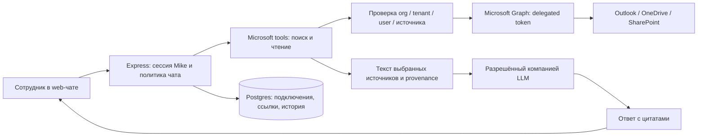

# Microsoft 365: анализ архитектуры и план интеграции

> Обновление 2026-09-07: основной read-only web MVP реализован локально. Фактические решения (отдельные защищённые чаты и buffered ответы), ограничения и оставшаяся приёмка описаны в [PRD](microsoft365-protected-chat-prd.md), [руководстве](microsoft365-setup.md) и [TODO](../TODO.md). Ниже сохранён исходный широкий архитектурный план.

Дата: 2026-09-06. Основание: статическое изучение checkout `c3b8960` и актуальных страниц Microsoft Learn. Статус: предложение к реализации, не реализованный функционал. Корпоративный tenant, лицензии и развёрнутая инфраструктура не проверялись; тесты приложения в рамках анализа не запускались.

## 1. Цель и рекомендуемая первая версия

Сотрудник подключает рабочую учётную запись Microsoft 365 и в чате Mike обсуждает свою переписку и доступные ему документы OneDrive for Business / SharePoint, включая файлы каналов Teams, хранящиеся в SharePoint. Ответы содержат проверяемые цитаты и ссылки на оригиналы.

Рекомендуется встроенный серверный коннектор Microsoft Graph с delegated permissions: каждый запрос исполняется от имени конкретного сотрудника. Для одной компании — single-tenant Entra application. Поиск выполняется в Microsoft по запросу пользователя; Mike читает только выбранные результаты. Полная синхронизация и векторная база для первой версии не нужны.

Рабочее предположение: первая версия охватывает личный рабочий mailbox и доступные пользователю корпоративные файлы. Shared mailboxes, централизованный архив и совместные ответы рассматриваются отдельно. Это граница предлагаемого MVP, а не подтверждённое ограничение потребности заказчика.

Примеры сценариев:

- «Какие обязательства мы согласовали с компанией X в переписке за август?»
- «Найди последнюю доступную версию договора в SharePoint и сравни с замечаниями из писем» — вывод о последней версии ограничивается найденными источниками и проверенными метаданными.
- «Суммируй эту цепочку и перечисли открытые вопросы, ссылаясь на письма».
- «Объясни различия между этими двумя файлами из OneDrive».

В MVP: web-чат, чтение, поиск, выбор источников, сравнение, цитирование, переподключение и отключение. Отправка писем, запись в Microsoft, Teams-сообщения, календарь, OCR сканов и поиск по всему tenant без участия пользователя — отдельные задачи.

## 2. Как устроен проект сейчас

| Подсистема | Подтверждено в коде | Значение для интеграции |
| --- | --- | --- |
| Web | Next.js 16 / React 19; `frontend/src/app/hooks/useAssistantChat.ts`; API в `frontend/src/app/lib/mikeApi.ts` | Использовать существующий чат и SSE, добавить выбор внешних источников |
| API | Express; `backend/src/app.ts:284`; маршруты `chat.ts`, `projectChat.ts`, `wordChat.ts` | Авторизация подключения и Graph-вызовы остаются на backend |
| Идентичность Mike | Supabase Auth, HttpOnly cookie, Bearer-совместимость; `backend/src/middleware/auth.ts:132`; OAuth endpoint разрешает Google в `backend/src/routes/auth.ts:187` | Microsoft account linking реализовать отдельно от входа в Mike; Microsoft SSO не является условием MVP |
| Организации и права | `organizations`, `org_members`, проекты, индивидуальные grants; `backend/schema.sql:193`; `backend/src/lib/access.ts:196` и `:524` | Организации уже есть, но связки с Entra tenant нет; права Mike и Microsoft — разные проверки |
| Работа модели | AI SDK, несколько провайдеров и Ollama; `backend/src/lib/llm/providers.ts`; `backend/src/lib/chat/streaming.ts:230` | Добавить ограниченный набор Microsoft tools в существующий цикл; отдельно ограничить допустимых провайдеров |
| Документы | `DocStore`, `DocIndex`, `buildDocContext`, `buildProjectDocContext`; `backend/src/lib/chat/contextBuilders.ts:548`; чтение в `tools/documentOps.ts:1508` | Повторно использовать извлечение текста PDF/DOCX/XLSX/PPTX, не импортировать облачные файлы автоматически в обычную библиотеку |
| Поиск | `read_document`, `find_in_document`, `fetch_documents`; в изученном чат-контуре и schema нет универсального embedding/vector retrieval | Это инструменты чтения и поиска в документах; корпоративный semantic RAG ещё не реализован |
| Внешние подключения | MCP OAuth, PKCE/state, зашифрованные токены, список tools, аудит; `backend/src/lib/mcp/oauth.ts`; `mcp/client.ts:65`; `mcp/servers.ts:446` | Использовать имеющиеся паттерны, но Graph не является MCP endpoint |
| UI коннекторов | `frontend/src/app/(pages)/settings/connectors/page.tsx:116` | Добавить готовый пункт Microsoft 365 без ввода URL сервера или bearer token сотрудником |
| Источники и цитаты | `backend/src/lib/chat/citations.ts`; `backend/src/lib/sourceDocuments.ts`; `frontend/src/app/components/assistant/message/CitationSources.tsx` | Расширить типы для писем/облачных файлов и авторизованный просмотр источника |
| Задания | `backend/src/lib/dbq/handlers.ts`, Postgres `db_jobs`, BullMQ для доставки; `backend/src/lib/queue/appJobsQueue.ts:4` | Использовать существующие задания для очистки; позднее — для delta sync, без обязательного нового сервиса |
| Word | Отдельные маршруты/история, Office.js, общий backend; `word-addin/src/taskpane/hooks/useWordAssistantChat.ts` | Add-in не даёт автоматического доступа к Outlook/Graph; его подключение — следующая клиентская итерация |

Готового Microsoft Graph / Outlook / OneDrive-коннектора в изученных `backend/src`, `frontend/src`, `word-addin/src` и schema не найдено. Упоминания Microsoft связаны преимущественно с Word add-in.

## 3. Архитектурное решение

Последовательность запроса: проверить сессию Mike → организацию и подключение → допустимость источников в этом чате → Graph Search → прочитать выбранные письма/файлы → нормализовать текст → передать ограниченный контекст модели → проверить цитаты → сохранить защищённый ответ и происхождение источников.

Результаты поиска — кандидаты, а не доказательства: точную цитату строить только по реально прочитанному тексту. Для неполных результатов, недоступного вложения или усечённого файла показывать границу покрытия, не заявлять анализ всей почты/всей компании.

Варианты решения:

| Вариант | Оценка |
| --- | --- |
| Встроенный Graph adapter | Рекомендуется: контролируемые права, цитаты, UX, ошибки, хранение, нет отдельного MCP-сервиса |
| Собственный Graph MCP server | Возможен, если этот коннектор нужен нескольким приложениям; добавляет deployment и границу хранения/токенов |
| Сторонний MCP server | Быстрый эксперимент после проверки поставщика; сам по себе не решает private/shared history, ACL и цитирование |
| Полный импорт в локальный RAG | Полезен при доказанной потребности в масштабе/поиске, но требует синхронизации, актуальности ACL и удаления копий |

Не превращать существующий `user_mcp_connectors.server_url` в URL Graph: он ожидает MCP protocol и discovery. Создать небольшой `backend/src/lib/microsoft365/` с явными Graph operations; общие криптографические/аудит-паттерны переиспользовать без масштабного рефакторинга MCP.

## 4. Microsoft: лицензии, регистрация и permissions

Обычные Graph APIs для почты/файлов не требуют отдельной подписки Microsoft 365 Copilot. Нужны действующие сервисы Exchange Online, OneDrive/SharePoint в тарифе компании и разрешения tenant. Стандартные Graph APIs в пределах применимых лимитов входят в пользовательскую лицензию; LLM, вычисления и хранение Mike оплачиваются отдельно. Точный SKU, тип Microsoft cloud и ограничения компании проверяются на подготовительном этапе [M1, M2].

Для одной компании зарегистрировать single-tenant Entra app с backend Web redirect URI. Использовать Authorization Code + PKCE, одноразовый `state`, OIDC `nonce`, проверку issuer/audience/tenant и стабильного идентификатора Microsoft account. Привязка — к уже вошедшему пользователю Mike, организации и `(tid, oid)`; email/displayName — атрибуты отображения, не ключ безопасности. Для гостей/B2B проверить identity в ресурсном tenant, не связывать аккаунты только по совпадению email [M3].

| Функция | Delegated scopes | Комментарий |
| --- | --- | --- |
| Идентичность и длительное подключение | `openid profile offline_access`, `User.Read` для реально используемого `/me` | Graph tokens не выдавать браузеру; app credential и token cache — серверные |
| Своя почта: поиск и полный текст | `Mail.Read` | `Mail.ReadBasic` недостаточно для чтения body/вложений |
| Только свой OneDrive, адресный browse/search | `Files.Read` | Работает с соответствующими drive endpoints |
| Поиск доступных корпоративных файлов через `/search/query` | `Files.Read.All` | Делегированный доступ в пределах прав сотрудника; `Files.Read` для этого Search недостаточно |
| Sites/list items как самостоятельные сущности | `Sites.Read.All`, только при появлении такого сценария | Не добавлять автоматически к файловому MVP |
| Общий почтовый ящик | `Mail.Read.Shared`, отдельный этап | Требует доступа пользователя к этому ящику; имеет отдельные ограничения поиска/подписок |

Предлагаемый MVP с корпоративным файловым поиском: identity scopes + `Mail.Read` + `Files.Read.All`. Запрашивать доступ к почте и файлам по включению соответствующей функции. В consent объяснить реальный объём `Files.Read.All`; выбранные в Mike папки сужают поведение приложения, но не сужают уже выданный OAuth scope [M4–M6].

Указание `AdminConsentRequired: No` в справочнике delegated permissions не гарантирует самостоятельное подключение: user consent может быть запрещён политикой компании. Включить IT-этап регистрации app, consent/назначения пилотной группы и проверки Conditional Access/MFA. Не требовать `Mail.ReadWrite`, `Mail.Send`, application `Mail.Read`/`Files.Read.All` для первой версии [M7].

Если IT разрешает только конкретные сайты, рассмотреть `Sites.Selected` / Selected operations с отдельными resource grants. Они поддерживают delegated и application режимы, однако не являются прозрачной заменой прав для глобального Graph Search. Для такого варианта нужен отдельный spike адресных endpoints и поиска внутри разрешённого набора; не обещать `/search/query` на Selected scopes [M8].

Реализация OAuth: предпочтительно официальный Microsoft identity client после проверки совместимости. Новую зависимость не добавлять в рамках этого плана; при реализации отдельно зафиксировать выбор, соблюдая правило репозитория о зависимостях. Протокольные операции, валидация токенов, refresh и CA нельзя считать готовыми только из-за наличия generic MCP OAuth.

## 5. Правила доступа и хранения — часть MVP

Критический факт: `createServerSupabase()` использует service role и обходит RLS (`backend/src/lib/supabase.ts:10`). Новым запросам нужны явные проверки владельца подключения, организации, tenant и источника; включённый RLS сам по себе не защищает backend.

Существующие `GET /chat/:chatId` и exports выдают сохранённую историю на основании прав Mike. В ней есть ответ и цитаты. Генерация/копирование документов создаёт самостоятельные файлы. Поэтому Graph ACL защищает новый fetch, но не уже сохранённые выдержки (`backend/src/routes/chat.ts:204`, `:1074`; `backend/src/lib/userDataExport.ts:74`; `backend/src/lib/chat/tools/documentOps.ts:574`, `:1038`).

Предлагаемая минимальная политика:

1. Microsoft sources разрешены только в личном standalone web-чате без grants и project membership. Перед первым поиском атомарно включать неизменяемый признак защищённого чата: даже subject/имя файла из поиска являются корпоративными данными.
2. Связать такой чат с корпоративной политикой через отдельную ссылку, а не менять смысл `chats.org_id`: сейчас `org_id` требует `project_id`. Снятие доступа к организации блокирует подключение и этот чат, даже если Mike account остаётся личным.
3. В MVP запретить раздачу доступа, перенос в общий проект, экспорт такого чата и создание обычных библиотечных/проектных документов из его контекста. Проверять API/очереди, а не только кнопки; устранить гонку share ↔ первый Microsoft-запрос. Позднее разрешать конкретные действия через политику и наследование ограничений производными объектами.
4. В защищённом чате ограничить tools на уровне объявления и исполнения. Отключить произвольные MCP, внешние исследовательские запросы и запись документов, чтобы текст письма не мог через prompt injection вызвать отправку данных наружу. Сами письма, имена файлов и вложения — недоверенный контекст, не инструкции.
5. Ограничить LLM route корпоративным allowlist, включая fallback, summaries/title generation и пользовательские API keys/gateway URLs. Microsoft 365 не означает, что данные остаются у Microsoft: текущие провайдеры Mike получают контекст. Выбор approved provider/региона и срока хранения — явная настройка компании; Azure OpenAI сейчас не выделен отдельным провайдером и потребует отдельной проверки/работы, если выбран.
6. Не сохранять всю почту/весь диск. Тела выбранных источников держать в памяти одного запроса; большой временный файл удалять в `finally` плюс cleanup job. Если нужен кэш — короткий TTL, шифрование, ключ с owner/tenant/connection/resource/version и проверка Graph доступа перед повторным использованием.
7. Хранить provenance ответов: от какого подключения и каких source refs они зависят. До повторной подачи старого контекста модели и выдачи защищённой истории проверять текущую доступность зависимостей. При отзыве/недоступности закрывать зависимый контекст; для MVP допустимо блокировать весь защищённый чат до восстановления/очистки. Не обещать мгновенный отзыв уже прочитанных человеком данных или обход задержек Microsoft ACL propagation.
8. Отключение подключения немедленно запрещает новые операции и блокирует зависимую историю; удаление токенов, кэша и производных данных выполнять надёжным заданием по политике retention. Проверять connection generation перед финальной записью и внутри queued jobs, чтобы старый запрос не вернул данные после отключения. Удаление локальных токенов не равно удалению consent в Entra; это отдельная операция с учётом политики tenant и прав пользователя/администратора.
9. Срок хранения ответов, цитат, резервных копий, аудит-событий и порядок корпоративного экспорта зафиксировать до пилота. Очистка охватывает БД, временные объекты, задания и ранее созданные export artifacts; backup deletion имеет свой срок. Аудит содержит action, opaque resource ID, результат, длительность, Graph request ID; не body/subject/query/token.
10. Запретить raw LLM logging для защищённых turns независимо от debug env. Сейчас есть `LOG_RAW_LLM_STREAM`, `RAW_LLM_STREAM_LOG_DIR` (`backend/src/lib/llm/rawStreamLog.ts:42`) и dev preview извлечённого текста (`documentOps.ts:1718`). Это потенциальные каналы сохранения данных, не доказательство утечки в текущем deployment.

Не считать эти пункты обнаруженными эксплуатируемыми уязвимостями готового M365-коннектора: его ещё нет. Это выявленные несовместимости текущих механизмов с предлагаемой моделью корпоративного доступа.

## 6. Контракты backend и данных

Предлагаемые модули: `microsoft365/oauth.ts`, `client.ts`, `mail.ts`, `files.ts`, `access.ts`, `sourceRefs.ts`; чат-инструменты в `backend/src/lib/chat/tools/microsoft365Tools.ts`. Новый router `backend/src/routes/microsoft365.ts`, подключаемый в `app.ts`. Названия предварительные, без универсального plugin framework.

Предлагаемые endpoints:

- `GET /integrations/microsoft365` — безопасный статус подключения, account/tenant display, capabilities, необходимость повторного входа.
- `POST /integrations/microsoft365/connect` и `GET /integrations/microsoft365/callback` — старт из авторизованной сессии; callback по одноразовому сохранённому state с проверкой привязки. В popup только статус, без tokens/code; проверка origin/source.
- `DELETE /integrations/microsoft365/:connectionId` — немедленно отключить и поставить очистку в очередь.
- `POST /integrations/microsoft365/search` — единый сервис для UI picker и tool; фильтры и страницы ограничены сервером.
- `GET /integrations/microsoft365/sources/:sourceRefId` — авторизованный просмотр/чтение, повторная проверка прав, `Cache-Control: no-store`.

Предлагаемые tools: `m365_search_mail`, `m365_read_mail`, `m365_read_thread`, `m365_search_files`, `m365_read_file`, `m365_read_attachment`. Schema принимает ограниченный query/filter или opaque source reference. User/tenant/token/mailbox identity разрешает backend; модель не может выбрать произвольного пользователя или передать произвольный URL для fetch. Разрешить только чтение заявленных Microsoft resources; контролировать повторные вызовы, число результатов и общий объём контекста.

Предлагаемые изменения schema:

| Сущность | Основные поля/инварианты |
| --- | --- |
| `org_microsoft365_policies` | `org_id`, доверенный `tenant_id`, разрешённые capabilities/sites, approved LLM policy, retention, enabled; изменяет org admin, но не получает токены сотрудников |
| `user_microsoft365_connections` | `id`, `user_id`, `org_id`, `tenant_id`, `microsoft_oid`, granted scopes, status, connection generation, encrypted token cache; уникальность для выбранного режима одного account/user/org |
| `microsoft365_oauth_states` | Одноразовый hash state, user/org/session binding, nonce, encrypted PKCE verifier, expires_at; atomic consume |
| `microsoft365_source_refs` | Owner/connection, тип message/file/attachment, mailbox + immutable message ID либо driveId + itemId, version/eTag, безопасный webUrl, время чтения; sensitive metadata защищены как сам источник |
| `chat_external_source_refs` и политика защищённого чата | Chat/message dependencies, org-policy link, connection generation; транзитивная связь последующих ответов, включая summaries, с исходными данными |
| Audit / cleanup jobs | Расширение существующей инфраструктуры без содержимого писем в job payload; scoped opaque IDs, idempotency/dedupe |

Новые таблицы закрыть для прямого `anon/authenticated` чтения по текущей backend-only модели, включить RLS и точные серверные owner checks. Проверять совместимость FK tenant/org/connection, ротацию ключей и атомарное обновление token cache с блокировкой конкурирующих refresh. Секреты — только на backend, с идентификатором версии ключа; не в `mikeApi.ts`, localStorage, telemetry или логах.

Миграцию создать при реализации с актуальной датой и следующим свободным `NN`, одновременно обновить `backend/schema.sql`. В рамках плана миграция и удалённые изменения БД не выполняются.

## 7. Поиск, чтение и цитирование

Почта: `/search/query` с `entityTypes: ["message"]`, затем чтение конкретных messages/attachments. Search работает по собственному mailbox; `conversationId` использовать для получения доступных писем цепочки с пагинацией и ограничением, не подразумевая охват shared/archive mailbox. `total` для message Search не использовать как точное число всех совпадений [M9].

Для стабильной идентичности писем использовать immutable IDs там, где поддерживается, и отдельно identity mailbox; обычный message ID меняется при перемещении. Перенос в archive mailbox — отдельная граница даже для immutable ID [M10]. HTML body преобразовать в безопасный текст без выполнения HTML и загрузки remote images. Вложения: различать file/item/reference attachments; поддерживаемые файлы извлекать существующими парсерами, unsupported/encrypted/IRM защищённые помечать как недоступные для анализа. Не обещать чтение защищённых Purview документов обычным парсером.

Файлы: Graph Search `driveItem`, проверка актуальных метаданных и чтение `/drives/{driveId}/items/{itemId}/content`. Файлы каналов Teams покрываются как SharePoint files, а сообщения Teams — нет. Search индекс может запаздывать; добавить адресный выбор файла/папки как путь к известному источнику [M5, M11].

Проверять MIME/signature, предельный размер байтов, распаковки и извлечённого текста, timeout и отмену. Это конфигурируемые лимиты Mike, не заявленные лимиты Microsoft. Не передавать bearer на download redirect host; временные preauthenticated download URLs не логировать/не сохранять/не отдавать модели. Graph `nextLink` и download redirects обрабатывать как специальные доверенные протокольные данные с проверкой URL/host, а не разрешать произвольные модельные URLs.

Новые citation kinds `m365_mail`/`m365_file`: sourceRef, версия/eTag или message lastModified, время получения, точная цитата, locator (страница/абзац/лист/ячейка либо письмо). Проверять цитату по нормализованному прочитанному тексту. Ссылки и названия берёт backend из metadata, не сочиняет модель. Для изменившегося источника явно различать версию ответа и текущую; не выдавать прежнюю цитату за подтверждённую новой версией.

Расширить `SourceDocument` и `CitationSources`, используя общий визуальный контракт. Корпоративный viewer должен выполнять Graph/source ACL проверки; не подменять его маршрутом публичных юридических источников `case:*`.

## 8. Пользовательский интерфейс

В существующих настройках коннекторов: Microsoft 365 → «Подключить рабочую учётную запись» → Microsoft consent → имя account/компания и доступные функции. Обычному сотруднику не нужны поля client secret, server URL или scopes. Политика и диагностика tenant находятся в настройках организации.

В `ChatInput`: выбор «Почта», «Корпоративные файлы», фильтры периода/отправителя/расположения и picker конкретных писем/файлов. Источники включаются явно для чата; подключение аккаунта само по себе не должно включать поиск почты во всех беседах. При входе из общего проекта открыть отдельный личный защищённый чат.

Показывать реальный ход: поиск → чтение источников → ответ. Карточка цитаты: тема/имя, отправитель или расположение, дата, версия, выдержка и «Открыть в Outlook/SharePoint». Статусы: требуется администратор, повторный вход, источник недоступен, частичная выдача, неподдерживаемое вложение. Не выводить raw Graph/Entra errors.

Переиспользовать компоненты по `docs/design-system.md`, обновить skeleton/loading состояния и accessibility. Новые общие компоненты для add-in размещать в `frontend/src/shared/ui/` с Tailwind `@source` при фактическом подключении второго клиента.

## 9. Этапы и приёмка

| Этап | Работы и точки изменения | Критерий готовности |
| --- | --- | --- |
| 0. Tenant spike и PRD | Проверить лицензии/cloud, IT consent, 2 пилотных account с разными правами, site/drive, approved LLM; подготовить PRD по `docs/templates/PRD.md` | Реальный delegated OAuth, поиск и чтение тестового письма/файла; недоступный объект не читается; выбран scope profile |
| 1. Подключение и политика | Schema + migration, OAuth/token cache, org/tenant binding, status/disconnect, `mikeApi.ts`, connector settings | Refresh/reconnect/ошибки работают; чужой connection и другой tenant отвергаются; токены не появляются в browser/logs |
| 2. Защищённые чаты | `access.ts`, `chat.ts`, streaming/dispatcher, provenance, exports, cleanup, LLM policy | Нельзя включить Microsoft в shared chat или затем расшарить защищённый; покрыты гонки, history, summaries, generated docs и exports |
| 3. Outlook + файлы | Graph adapters/tools, parser reuse, pagination, limits, attachments, permission recheck | Поиск/чтение/сравнение реальных синтетических источников; корректные 401/403/404/429; partial results не скрываются |
| 4. UI, цитаты, пилот | Source picker, SSE, citation contracts/viewer, retention jobs, deployment/env docs | Ответы с проверяемыми цитатами; доступ не пересекается между двумя пользователями; disconnect/ACL revoke проверены на tenant |

Этап 2 должен предшествовать доступу чата к корпоративному содержимому. Backend adapters и UI можно разрабатывать параллельно после фиксации контракта. До реализации оформить PRD issue по CONTRIBUTING; этот документ является локальной заготовкой, публикация issue не выполнялась.

Плановая оценка: 25–40 инженерных рабочих дней на web MVP с тестами и защищённой историей; ориентировочно 4–6 календарных недель для двух разработчиков при доступном QA и оперативном IT. Это оценка по статическому анализу, не обещание срока. Tenant approval, выбранный узкий permission profile, новый LLM deployment и дополнительные требования retention могут изменить срок. После этапа 0 оценку пересмотреть.

Дальнейшие этапы:

- Shared mailboxes: `Mail.Read.Shared`, проверка делегирования и отдельные mail endpoints. Graph message Search не ищет shared/delegated mailbox; delegated Shared scopes не поддерживают subscriptions на общие папки [M12].
- Word add-in: те же backend connections, отдельный consent/dialog UX. Проверить server/local history modes: текущий клиент сохраняет историю в IndexedDB; не переносить корпоративный контекст в local mode автоматически.
- Совместные проектные чаты: отдельная модель доступа к производным ответам для всех читателей, с проверкой источников и обновлением прав участников. Не использовать connection автора как общий сервисный credential.
- Delta sync / индекс: только после измерения ограничений live search. Message delta — на отдельную папку; drive delta требует обработки удалений и `410 Gone`/resync. Подписки возобновляются, webhook лишь запускает reconciliation; `nextLink`/`deltaLink` хранить как opaque sensitive state. Использовать текущие `db_jobs`, throttling/backoff и при необходимости существующий Redis [M13–M16].
- Локальный semantic/hybrid RAG: отдельные extraction/chunking/embedding и permission-aware retrieval; chunks никогда не доступны только потому, что однажды успешно скачаны. Перед ответом нужна проверка актуальных source ACL. App-only company-wide ingestion — самостоятельная модель прав/администрирования, а не переключатель MVP.
- Draft/send/edit: отдельные scopes, preview и подтверждение конкретного действия, идемпотентность и аудит. Не включать в read-only MVP.

## 10. Проверки реализации

Минимальный обязательный набор regression tests:

- OAuth state replay/expiry, PKCE mismatch, nonce/issuer/tid mismatch, login/linking CSRF, конкурирующие refresh, `invalid_grant`, `interaction_required` и Conditional Access claims challenge [M3, M17, M18].
- Два account одной компании с разными правами и account другого tenant: search/read/cache/citation/history/export/sourceRef не пересекаются. Org admin Mike не получает почту участника за счёт роли.
- Закрытие доступа в Graph, удаление источника, выход из организации, disconnect во время SSE/cleanup job, попытка переподключить другой Microsoft account: зависимый контекст не подаётся модели и не открывается по старому URL.
- Shared/project chat → Microsoft tool и private M365 chat → share/move/export/generate: запреты действуют через прямой API, forged tool call и background job. Проверить гонки, а не только последовательные запросы.
- Prompt injection в письме/вложении/названии не открывает запрещённые tools/LLM endpoints; произвольный URL не становится Graph download; metadata и временные download URLs не попадают в логи.
- Пагинация, `429`/`Retry-After`, timeout/abort, частичный отказ одного источника, повреждённый/слишком большой файл, HTML remote images, encrypted attachment, изменённая версия и ложная цитата.
- Browser E2E: connect/status, picker → вопрос → citations → открыть оригинал, reconnect, запрет share и disconnect. Проверить отсутствие provider tokens в storage/URLs; отдельно mock-only и live tenant результаты.

Запуск при реализации: targeted Vitest → `npm test --prefix backend` / `npm run build --prefix backend`; relevant frontend tests / lint / build; schema drift + real-Supabase access tests по документации локального стека; затем E2E на синтетических данных и живой M365 canary. Word typecheck/build/E2E добавляются при изменении add-in. Сам план не доказывает готовность интеграции; passing mocks не заменяют реальную проверку consent, Graph и ACL.

Практическая приёмка пилота: набор заранее размеченных писем/цепочек и файлов, минимум два пользователя с разными доступами; все ожидаемые источники доступны адресным выбором, ограничения поиска объяснены, цитаты совпадают с прочитанным текстом, ни один negative access case не возвращает содержимое. Измерить latency, Graph calls и LLM tokens на сценарий; пороги SLO установить после spike, не выдумывать производительность из статического кода.

## 11. Что требуется уточнить до корпоративного пилота

1. Tenant ID, тариф и наличие Exchange Online/SharePoint/OneDrive, public/national cloud, IT-владелец app registration и consent.
2. Личная почта либо также shared mailboxes; доступные пользователю файлы либо строго перечисленные сайты/папки.
3. Approved LLM/provider/регион, допустимость передачи корпоративного текста этому обработчику, политика логов/retention/export.
4. Нужен ли Microsoft SSO для входа в Mike и жизненный цикл увольнения/удаления сотрудника; account linking сам по себе это не решает.
5. Нужны ли совместные чаты, Word add-in и записи обратно в Microsoft в первой поставке; это увеличит объём относительно предложенного MVP.

Эти пункты не блокируют разработку контрактов и тестов на синтетических fixtures, но tenant-dependent ветки и корпоративный rollout требуют подтверждённых значений.

## 12. Первичные источники Microsoft

Страницы проверены 2026-09-06; поддержка API и tenant policies может меняться.

- [M1: Microsoft Graph metering overview](https://learn.microsoft.com/en-us/graph/metered-api-overview)
- [M2: Metered APIs and services](https://learn.microsoft.com/en-us/graph/metered-api-list)
- [M3: Authorization Code flow и PKCE](https://learn.microsoft.com/en-us/entra/identity-platform/v2-oauth2-auth-code-flow)
- [M4: Graph permissions reference](https://learn.microsoft.com/en-us/graph/permissions-reference)
- [M5: Search query API и permissions](https://learn.microsoft.com/en-us/graph/api/search-query?view=graph-rest-1.0)
- [M6: DriveItem search](https://learn.microsoft.com/en-us/graph/api/driveitem-search?view=graph-rest-1.0)
- [M7: Configure user consent](https://learn.microsoft.com/en-us/entra/identity/enterprise-apps/configure-user-consent)
- [M8: Selected permissions](https://learn.microsoft.com/en-us/graph/permissions-selected-overview)
- [M9: Message Search и ограничения](https://learn.microsoft.com/en-us/graph/search-concept-messages)
- [M10: Outlook immutable IDs](https://learn.microsoft.com/en-us/graph/outlook-immutable-id)
- [M11: OneDrive/SharePoint Search](https://learn.microsoft.com/en-us/graph/search-concept-files)
- [M12: Shared/delegated mail folders](https://learn.microsoft.com/en-us/graph/outlook-share-messages-folders)
- [M13: Message delta](https://learn.microsoft.com/en-us/graph/delta-query-messages)
- [M14: Drive delta](https://learn.microsoft.com/en-us/graph/api/driveitem-delta?view=graph-rest-1.0)
- [M15: Subscriptions и сроки жизни](https://learn.microsoft.com/en-us/graph/api/resources/subscription?view=graph-rest-1.0)
- [M16: Throttling](https://learn.microsoft.com/en-us/graph/throttling)
- [M17: Refresh tokens](https://learn.microsoft.com/en-us/entra/identity-platform/refresh-tokens)
- [M18: Claims challenges / Conditional Access](https://learn.microsoft.com/en-us/entra/identity-platform/claims-challenge)
